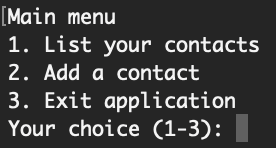

# Address-book

En enkel konsol-baserad addressbok. Utvecklad i kursen 1DV610 Mjukvarukvalitet, LNU 2022.

## Installation

Applikationen kräver grundläggande kunskap kring Node och NPM, om du inte har detta,
börja med att se följande resurser:

- [Node](https://nodejs.org/en/docs/guides/)
- [NPM](https://docs.npmjs.com/)

Börja med att installera beroenden:

`npm install`

Kör sedan applikationen med start-kommandot:

`npm start`

## Användning

Applikationen använder sig av ett enkelt ,konsol-baserat, gränssnitt.
Du använder appen genom att navigera med siffror och mata in text, bekräfta med enter.

Från huvudmenyn kan du välja att lista existerande kontakter,
skapa en ny kontakt eller avsluta applikationen.

Applikationen sparar kontaktdata lokalt i mappen `./data/`.

## Kända problem

[feature] Som användare vill jag kunna radera adresser ([#1](i1))

[i1]: https://github.com/wilnersson/address-book/issues/1

## Test

Det finns inga enhetstester implementerade. För testresultat, se [testrapporten](./testreport.md).

## Version

1.0.0

## Till examinator

[Reflection](./reflection.md)

[Requrements](./requirements.md)

[Testreport](./testreport.md)
