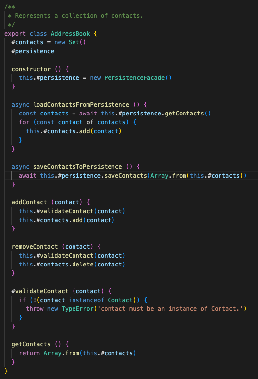
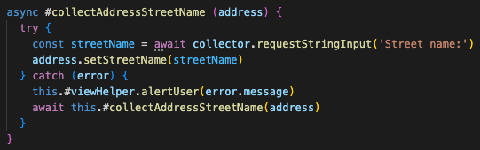
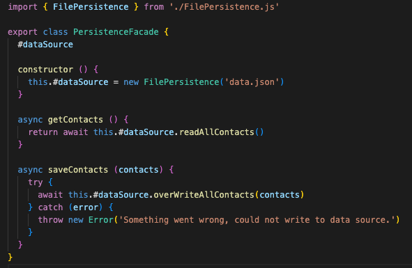
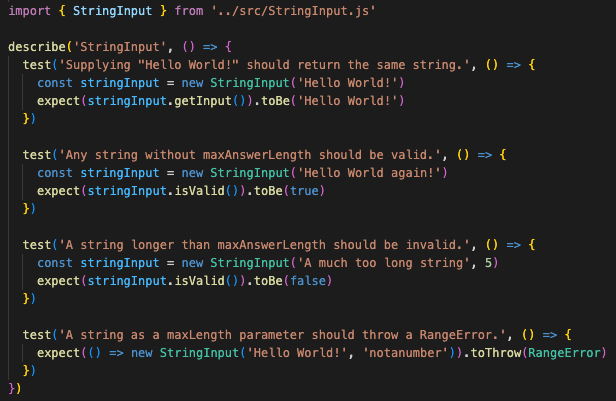
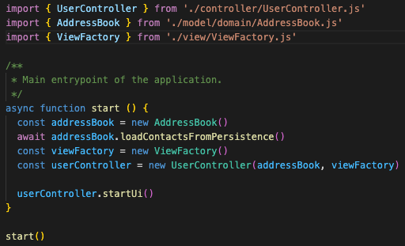

# Reflektioner Clean Code

Observera att jag har arbetat om min modul (L1) och lagt den i ett nytt repositorie. Anledningen till detta
är att jag i det nya repositoriet har tagit bort mina personliga reflektioner och tester som tillhör
laborationen, och laddat upp modulen som ett riktigt npm-paket. L1 som _faktiskt_ används i denna
applikationen ligger då på följande platser:

- [NPM-paket](https://www.npmjs.com/package/@wilnersson/console-input-collector)
- [Github-repositorie](https://github.com/wilnersson/console-input-collector)

## Kapitel 2 - Meaningful names

Generellt sett så har denna kursen fått mig att tänka mycket mer på, och vilja, skriva kod som flödar
mer som en skriven text än så som man stereotypiskt ser på kod. Med principer som
"intention-revealing names" och "pronouncable names" (samt reglerna för substantiv i klasser och objekt,
samt verb i metoder) så tycker jag att jag i många fall lyckats skapa en förståelse bara genom att
läsa koden rakt upp och ner. Se följande exempel från `UserController.js` där jag har en metod som styr
det övergripande flödet i applikationen. Tror knappast den behöver någon ytterligare förklaring.

## Kapitel 3 - Functions

Jag måste erkänna att jag var lätt skeptisk till många av riklinjerna kring funktioner till en början.
Men efter att ha försökt följa det efter bästa förmåga i detta projektet, så ser jag fördelarna.
De stora reglerna jag försökt följa är "small", "do one thing" och "one level of abstraction per function".
Jag har även försökt ta till mig av andra regler såklart, men dessa tre är de jag försökt
anamma likt ett mantra. Den delen som jag kanske är mest stolt över i min kod är följande stycke från
`FilePersistence.js`.

Återigen så går koden att läsa uppifrån och ner och jag tycker man, som utvecklare,
ganska snabbt förstår vad den gör. Det som jag skulle kunnat göra bättre här är att kolla på
abstraktionsnivån i metoderna `#getContactsFromParsedData()` och `#getSingleContactFromParsedData()`,
men jag hade svårt att hitta sätt att inte blanda abstraktionsnivå där.

Annat som är värt att nämna är att jag helt har gjort mig av med min fula ovana att använda booleans som
argument ("Flag Arguments"), samt försöker hela tiden hålla nere antalet argument i metoder till 1, helst 0.

## Kapitel 4 - Comments

Mitt mål med kommentarer i detta projektet har varit att vara så minimalistisk som möjligt, detta genom
att jobba efter principen "explain yourself in code". En av de första sakerna jag gjorde för att uppnå detta
var att lära mig att konfigurera ESLint. Jag har utgått från LNUs egna lint-konfiguration, men tagit bort
följande två krav:

- `require-jsdoc` som _kräver_ en kommentar ovanför varje modul, funktion, klass och metod.
- `require-description` som _kräver_ att alla kommentarer har en beskrivning.

Även innan denna kursen så har jag verkligen inte tyckt om att bli tvingad att kommentera allt. Det
tillför inte alltid något och gör att enkla klasser ser mer komplexa ut än vad de faktiskt är.
Nedan följer ett av få exempel där jag har lagt in en kommentar efter principen "informative comments".

Syftet med koden är att öppna en fil med kontaktdata, och ladda in denna data i applikationen. MEN, om filen
av någon anledning inte finns, så behöver den skapas. Detta uppnår jag genom att fånga undantaget med
felkod `ENOENT`, vilket betyder att filen inte hittas, och i så fall skapa en ny fil.
Felkoden är standard från fs-paketet som är inbyggt i Node, jag kan alltså inte påverka det.
Därav kändes en snabb kommentar som något som faktiskt tillförde information till koden.

## Kapitel 5 - Formatting

Något som jag sedan tidigare alltid jobbat med är principen "vertical openness between concepts", d.v.s.
framför allt genom att lämna tomma rader mellan olika koncept i min kod. Något som jag dock har tagit till
mig i denna kursen är att jobba med principen "vertical density". Tidigare har jag gärna velat gruppera
publika och privata metoder i två distinkta grupper. Jag har nu istället börjat gruppera dem efter koncept
och läsbarhet uppifrån och ner, ett "flöde". Följande är ett exempel från `ContactView.js` som tydligt
visar konceptuellt närbesläktade metoder som följer varandra i ett flöde.

Här i detta markdown-dokument så använder jag också principerna kring "horizontal formatting". Eftersom
markdown inte särskiljer mellanslag och radbryt så har jag manuellt lagt in radbryt för att göra dokumentet
mer läsbart oavsett om man läser det i preview eller som rå text.

## Kapitel 6 - Objects and Data Structures

Tycket detta är svåra koncept att reflektera kring, men mitt val av ett MVC-mönster "tvingar" mig till att
göra vissa val. Det som kommer närmast rena datastrukturer är vissa av klasserna i modellen
(tänker främst på `Contact` och `Address`). Dessa objekt representerar väldigt konkreta saker inom domänen,
men har trots det ändå vissa regler som gör att jag tvingar användandet av setters. Exempelvis validering
av strängar som skickas in. Dessa blir då en form av "hybrider", men det tycker jag är ok i ett
MVC-mönster. Ett bra exempel på "the law of Demeter" skulle kunna vara min `AddressBook`-klass. Detta
objekt har en tydlig intern data-struktur (listan över kontakter), men jag tillåter bara andra klasser
att _se_ innehållet, lägga till en kontakt eller ta bort en kontakt. Men jag tillåter inte direkt
manipulerande av listan.

## Kapitel 7 - Error handling

Hela applikationen är mer eller mindre byggd på principen "use exceptions rather than return codes" då
jag använder det överallt för att styra flöden, aldrig "return codes". Jag har också försökt följa
principen kring "define the normal flow" då jag styrt felhanteringen främst till mina vyer. Detta har jag
dock inte lyckats med helt och hållet, exempelvis så finns en del felhantering i persistence-modellen, men
i ett projekt av denna skala så kan jag tycka att det är ok. Nedan följer ett exempel på felhantering som
styr användarens flöde i en vy. Här upprepas input till dess att en validerad sträng är uppnådd.

## Kapitel 8 - Boundaries

Då min egen modul (`@wilnersson/console-input-collector`) är utformad på ett sådant sätt att användas
ganska frekvent i, exempelvis, en vy, så hade jag svårt att applicera dessa principer på just den modulen.
Men däremot tycker jag att ett bra exempel på "boundaries" är mitt användande av "Facade"-mönstret när det
gäller persistence. Klassen `PersistenceFacade` anser jag vara ett bra exempel på "boundaries" då den
avgränsar den faktiska implementationen av persistence från övriga applikationen. Fasaden är extremt enkel
och består bara av två metoder, men den döljer den betydligt mer komplexa implementationen i
`FilePersistence.js`.

## Kapitel 9 - Unit Tests

Denna applikation innehåller, p.g.a tidsbrist, inga enhetstester. Men däremot så gör min L1 det, tänke
därför applicera mina reflektioner där istället. Här känner jag att jag ändå gjort ett ganska bra jobb med
principerna kring "clean tests" och "single concept per test". Mycket får jag såklart gratis genom att
följa inbyggda metoder och rekommendationer från jest-ramverket. Men strukturen är byggd utifrån de olika
klasserna och testerna har tydlig läsbarhet och tydligt syfte. Nedan följer ett exempel med tester för
klassen som ska hantera och validera strängar.

## Kapitel 10 - Classes

Jag försöker alltid att skriva kod efter SRP (Single Responsibility Principle), även om man såklart inte
alltid lyckas. Ett exempel på detta är mina vyer som är uppdelade i olika ansvar, även om de rent tekniskt
fortfarande handlar om input/output. Boken clean code menar att längd på klasser ska räknas i
antalet "responsibilities", inte rader. Trots det så känns det bra att min längsta klass är mindre än 150
rader. Personligen tycker jag att "open/closed principle" och "dependency inversion principle" är väldigt
svåra att greppa, men jag har ändå ett "frö" till en sådan lösning. Återigen vänder jag mig till mitt
exempel med `PersistenceFacade`. Javascript stödjer inte realisation, men hade projektet byggts i
exempelvis Java så hade det varit en enkel sak att låta fasad-klassen ta emot ett `PersistenceInterface`
och låta `FilePersistence` och `MockData` implementera/realisera det interfacet. Det hade gjort
applikationen öppen till att lägga till nya tekniker för persistence, utan att behöva ändra existerande
klasser.

## Kapitel 11 - Systems

Generellt sett är koncepten i detta kapitlet svåra att greppa, speciellt vissa detaljer. Men det
övergripande budskapet går fram och jag tror att jag ändå delvis lyckats fånga detta i min applikation, och
då menar jag främst principen "separate constructing a system from using it". Det jag syftar till är mitt
användande av en `ViewFactory` som jag skickar till `UserController` att använda för att presentera ett UI
till användaren. Detta gör jag i `index.js`. I ett objektorienterat språk hade jag valt att göra
ViewFactory till ett interface, för att sedan låta varje typ av UI få en egen konkret fabrik;
`ConsoleViewFactory`, `HTMLViewFactory`, o.s.v. Jag hade även kunnat göra en liknande lösning för min
persistence, d.v.s. skapa ett interface `PersistenceInterface` och sedan göra konkreta implementationer av
detta. `index.js` hade sedan fått skapa en instans av en konkret persistence-klass och skicka med till
applikationen. Nedan är min `index.js`-fil.

