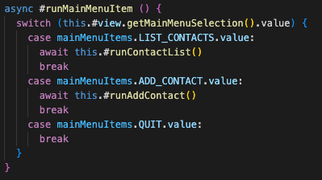
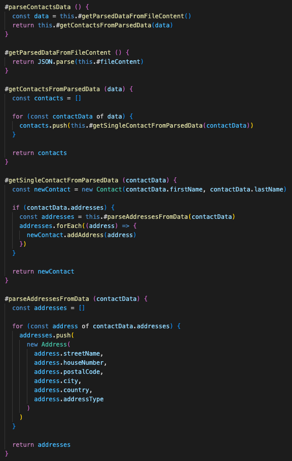
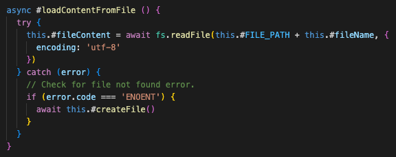
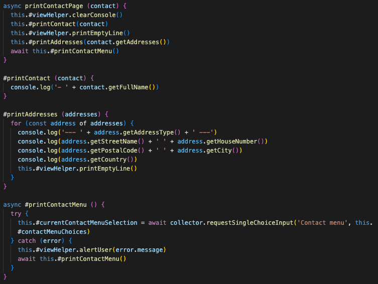

# Reflektioner Clean Code

TODO: Lägg till reflektioner för varje kapitel i boken, 4-6 meningar per kapitel med screenshots från kod i VARJE kapitel/stycke.

## Kapitel 2 - Meaningful names

Generellt sett så har denna kursen fått mig att tänka mycket mer på, och vilja, skriva kod som flödar
mer som en skriven text än så som man stereotypiskt ser på kod. Med principer som
"intention-revealing names" och "pronouncable names" (samt reglerna för substantiv i klasser och objekt,
samt verb i metoder) så tycker jag att jag i många fall lyckats skapa en förståelse bara genom att
läsa koden rakt upp och ner. Se följande exempel från `UserController.js` där jag har en metod som styr
det övergripande flödet i applikationen. Tror knappast den behöver någon ytterligare förklaring.

## Kapitel 3 - Functions

Jag måste erkänna att jag var lätt skeptisk till många av riklinjerna kring funktioner till en början.
Men efter att ha försökt följa det efter bästa förmåga i detta projektet, så ser jag fördelarna.
De stora reglerna jag försökt följa är "small", "do one thing" och "one level of abstraction per function".
Jag har även försökt ta till mig av andra regler såklart, men dessa tre är de jag försökt
anamma likt ett mantra. Den delen som jag kanske är mest stolt över i min kod är följande stycke från
`FilePersistence.js`.

Återigen så går koden att läsa uppifrån och ner och jag tycker man, som utvecklare,
ganska snabbt förstår vad den gör. Det som jag skulle kunnat göra bättre här är att kolla på
abstraktionsnivån i metoderna `#getContactsFromParsedData()` och `#getSingleContactFromParsedData()`,
men jag hade svårt att hitta sätt att inte blanda abstraktionsnivå där.

Annat som är värt att nämna är att jag helt har gjort mig av med min fula ovana att booleans som argument
("Flag Arguments"), samt försöker hela tiden hålla nere antalet argument i metoder till 1, helst 0.

## Kapitel 4 - Comments

Mitt mål med kommentarer i detta projektet har varit att vara så minimalistisk som möjligt, detta genom
att jobba efter principen "explain yourself in code". En av de första sakerna jag gjorde för att uppnå detta
var att lära mig att konfigurera ESLint. Jag har utgått från LNUs egna lint-konfiguration, men tagit bort
följande två krav:

- `require-jsdoc` som _kräver_ en kommentar ovanför varje modul, funktion, klass och metod.
- `require-description` som _kräver_ att alla kommentarer har en beskrivning.

Även innan denna kursen så har jag verkligen inte tyckt om att bli tvingad att kommentera allt. Det
tillför inte alltid något och gör att enkla klasser ser mer komplexa ut än vad de faktiskt är.
Nedan följer ett av få exempel där jag har lagt in en kommentar efter principen "informative comments".

Syftet med koden är att öppna en fil med kontaktdata, och ladda in datan i applikationen. MEN, om filen
av någon anledning inte finns, så behöver den skapas. Detta uppnår jag genom att fånga undantaget med
felkod `ENOENT`, vilket betyder att filen inte hittas, och i så fall skapa en ny fil.
Felkoden är standard från fs-paketet som är inbyggt i Node, jag kan alltså inte påverka det.
Därav kändes en snabb kommentar som något som faktiskt tillförde information till koden.

## Kapitel 5 - Formatting

Något som jag sedan tidigare alltid jobbat med är principen "vertical openness between concepts", d.v.s.
framför allt genom att lämna tomma rader mellan olika koncept i min kod. Något som jag dock har tagit till
mig i denna kursen är att jobba med principen "vertical density". Tidigare har jag gärna velat gruppera
publika och privata metoder i två distinkta grupper. Jag har nu istället börjat gruppera dem efter koncept
och läsbarhet uppifrån och ner, ett "flöde". Följande är ett exempel från `ContactView.js` som tydligt
visar konceptuellt närbesläktade metoder som följer varandra i ett flöde.

Här i detta markdown-dokument så använder jag också principerna kring "horizontal formatting". Eftersom
markdown inte särskiljer mellanslag och radbryt så har jag manuellt lagt in radbryt för att göra dokumentet
mer läsbart oavsett om man läser det i preview eller som rå text.

## Kapitel 6 - 

## Kapitel 7 - 

## Kapitel 8 - 

## Kapitel 9 - 

## Kapitel 10 - 

## Kapitel 11 - 

